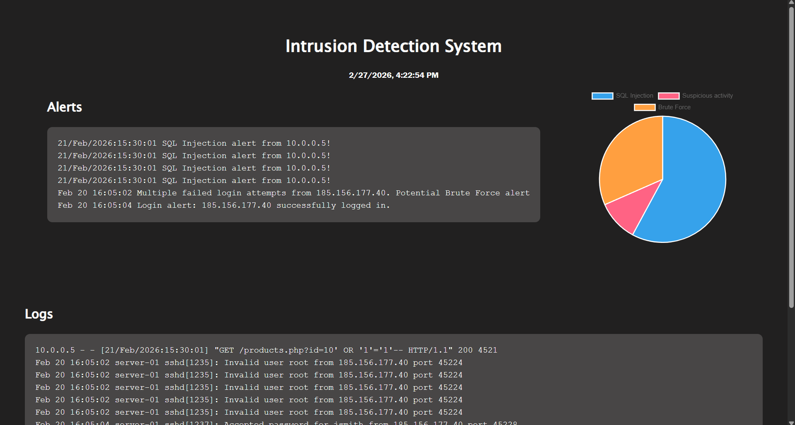
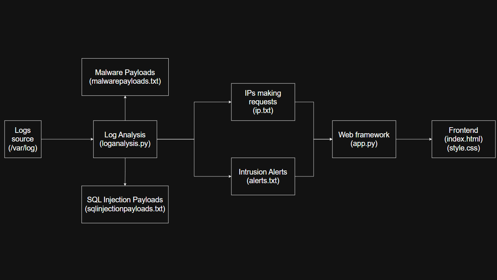
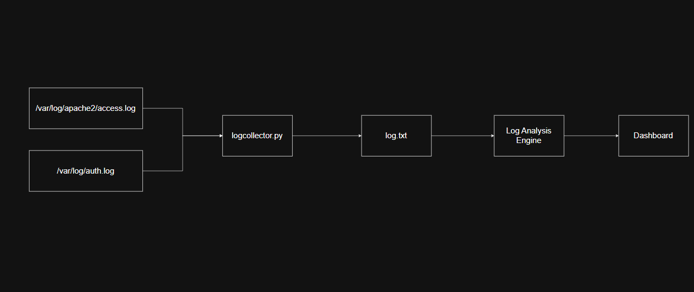

# Intrusion-Detection-System
Intrusion Detection System is a python built system that can detect simple intrusions in a network which can be done via the log files in linux machine.

# Problem Statement
Intrusion Detection Systems are often costly to be implemented by small organizations. Most of them are complex to use as well. It requires highly skilled human resource to set up such technology in an organization.

# Features
- Intrusions such as SQL injection, malware execution and brute-force attempts can be detected by the log patterns.
- The dashboard presents the alerts.
- Logs, chart of intrusions and the IP addresses that made requests can also be viewed in the dashboard.

# Limitation
- Only the Linux logs can be viewed so this system has to be implemented in a Linux machine.

# Technology used
- Python
- Flask - python framework for web
- HTML, CSS and JavaScript

